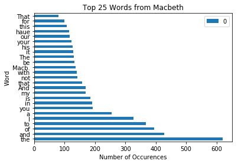

# Project: Analyzing Macbeth

For our first day and first data science project, we're going to do some rudimentry analysis of Shakespeare's classic play: Macbeth! You will get practice working with lists, condtionals and dictionaries, visualizing data, and thinking analytically about data.

## Objectives
You will be able to:
* Show mastery of the content covered in this section

### Getting the Data
Here we start by importing a python package and using it to pull the transcript of Macbeth from the project Gutenberg website. We also preview a few details about what is now stored in the variable macbeth; it's a string with 119,846 characters, the first 500 of which are printed below.


```python
import requests
macbeth = requests.get('http://www.gutenberg.org/cache/epub/2264/pg2264.txt').text

print(type(macbeth))
print(len(macbeth))
print(macbeth[:500])
```

    <class 'str'>
    119846
    ***The Project Gutenberg's Etext of Shakespeare's First Folio***
    ********************The Tragedie of Macbeth*********************
    
    This is our 3rd edition of most of these plays.  See the index.
    
    
    Copyright laws are changing all over the world, be sure to check
    the copyright laws for your country before posting these files!!
    
    Please take a look at the important information in this header.
    We encourage you to keep this file on your own disk, keeping an
    electronic path open for the nex


### Your Task

Your task is to create a bar graph of the 25 most common words in Shakespeare's Macbeth.

A common python programming pattern to counting objects, produce histograms, or update statistics is to make calls to a dictionary as you iterate through a list. For example, given a list of words, you can create a dictionary to store counts and then iterate through the list of words, checking how many times each word has appeared using your dictionary, and updating the dictionary count now that you've seen that word again. The dictionary.get() method is very useful in doing this. Read the docstring for the dictionary.get() method and use it along with the pseudocode above to create a bar graph of the 25 most common words from the transcript of Macbeth which has been loaded into a variable 'Macbeth'. Be sure to include a title and appropriate labels for your graph.


```python
import pandas as pd
import numpy as np
import matplotlib.pyplot as plt
%matplotlib inline
```


```python
# Your code here

# Pseudo-code Outline
# Split the transcript into words
words = macbeth.split()
# Create a dictionary
word_counts = {}
# Iterate through the text of Macbeth
for word in words:
    word_counts[word] = word_counts.get(word, 0) + 1 #Get previous entry, update by 1
# Update word counts
# Create Bar Graph

#With Pandas
counts = pd.DataFrame.from_dict(word_counts, orient='index')
counts = counts.sort_values(by=counts.columns[0], ascending=False)
counts.head(25).plot(kind='barh')
plt.title('Top 25 Words from Macbeth')
plt.ylabel('Word')
plt.xlabel('Number of Occurences')
# Include descriptive titles and labels
```


    <matplotlib.text.Text at 0x1c03bcdc748>





```python
#With Lists
counts = list(word_counts.items())
top_25 = sorted(counts, key = lambda x: x[1], reverse=True)[:25]
y = [item[1] for item in top_25]
X = np.arange(len(y))
plt.figure(figsize=(12,12))
plt.bar(X , y)
plt.xticks(X, [item[0] for item in top_25]);
plt.ylabel('Number of Occurences')
plt.xlabel('Word')
plt.title('Top 25 Words in Macbeth')
```


    <matplotlib.text.Text at 0x1c03c29eb70>


### Level Up (Optional)
* Create a list of top characters by mentions of their names 
* Split the text by which character is talking
* Create subgraphs of the most common words by character
* Reduce the string to the text of the play itself. (Remove any initial notes, forward, introduction, appendix, etc.)
* Come up with some other fun analyses of the text!

## Summary
Congratulations! You've got some extra practice combining various data types into useful programming patterns and done an intitial analysis of a classic text!
